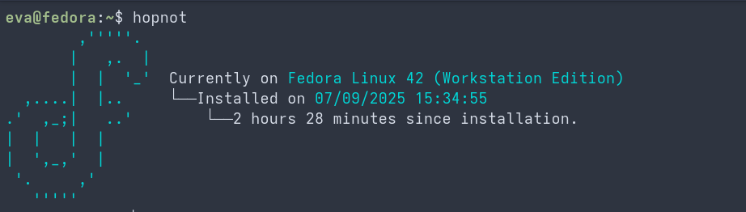

# HopNot

Rewrite of my old HopNotCLI app in lua!

# Showcase


# Usage
```txt
$ hopnot --help
hopnot (v1.0)
Show off how long your distro has been installed!

Options:
  [LONG]  [SHORT]  [VAR]   [DESCRIPTION]
  --logo  -l       [logo]  Show a specific logo, defaults to unknown if logo is not found.

Flags:
  [LONG]       [SHORT]   [DESCRIPTION]
  --nologo     -n        Show only the data, without a logo.
  --help       -h        Display the help message
  --list-logos -s        List the name of every logo available
```

# Running
## Building without compilation
First, you need to download lua and git.
```bash
# Ubuntu/Debian
sudo apt install lua5.4 git

# Fedora
sudo dnf install lua git
```

Now, you can clone the repo and run.
```bash
git clone https://github.com/hexedrevii/hopnot
cd hopnot

lua main.lua -h
```

# Compilation and installing
If you want to turn the program into an executable, you will need luarocks, luastatic and lua development libraries.

```bash
# Ubuntu/Debian
sudo apt install liblua5.4-dev gcc g++ make

# Fedora
sudo apt install lua-devel gcc g++ make
```

Now, we can compile by using luastatic.
```bash
luarocks install luastatic

# Fedora
luastatic main.lua logos.lua src/strutils.lua src/fs.lua lib/parser.lua /usr/lib64/liblua-5.4.so -I/usr/include -o hopnot

# Ubuntu
luastatic main.lua logos.lua src/strutils.lua src/fs.lua lib/parser.lua /usr/lib/x86_64-linux-gnu/liblua-5.4.so -I/usr/include/lua5.4 -o hopnot
```


# License
GPL 3.0
